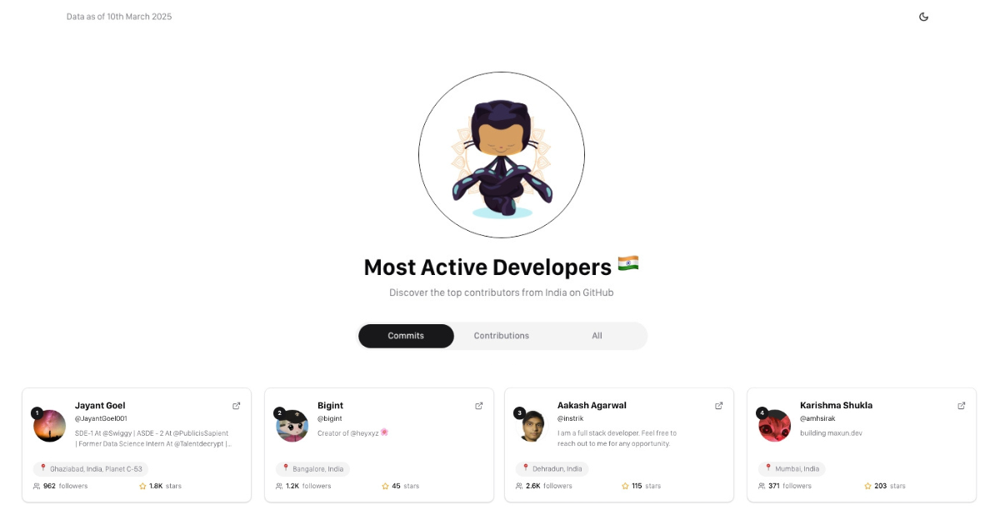

# Most Active Developers India 🇮🇳

This project showcases the most active developers from India on GitHub. The data is sourced from [committers.top/india](https://committers.top/india) by [ashkulz](https://github.com/ashkulz) and enriched with additional GitHub API data.

## 📊 Overview

The application displays the top GitHub users from India across three categories:
- **Commits** 📈: Users with the most commits
- **Contributions** 🤝: Users with the most public contributions
- **All** 🏆: Users with the most overall activity (public and private)

## Features

- 📱 Responsive design that works on mobile and desktop
- 🌓 Light and dark theme support
- 🔄 Automatic data updates via GitHub Actions
- 🎨 Clean and modern UI

## Technical Details

- 🍦 This is a vanilla implementation using HTML, CSS and Vanilla JavaScript (no frameworks)
- ⚙️ Uses `fetch-github-data.yml` workflow fetches the latest data from committers.top and the GitHub API

## ⚡ How It Works

1. A GitHub Action runs daily to fetch the latest ranking data
2. The data is processed and stored in a JSON file
3. The web application loads this data and displays it in a user-friendly interface